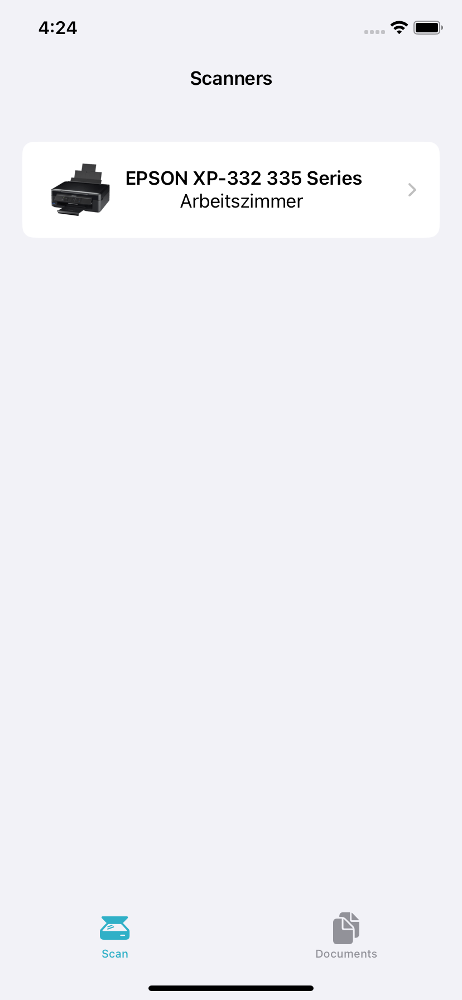
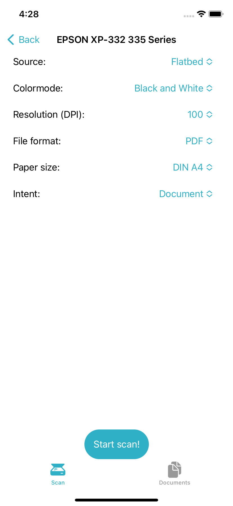
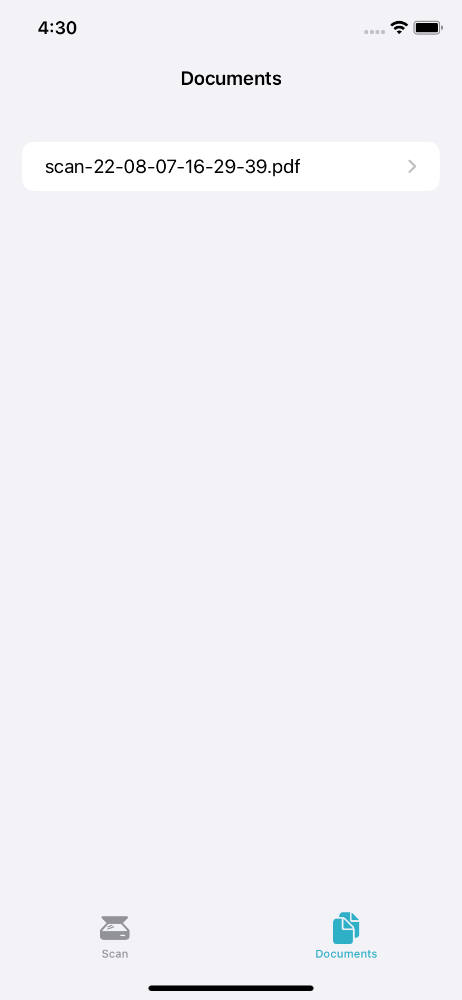

#  OpenAirScan - A Swift Implementation of the eSCL Protocol (aka AirScan)

I needed a Swift implementation of the eSCL protocol for another project and I now want to open source this.
This repo contains an entire XCode project with a small example application using the protocol. 
If you're only interested in the actual API, all files for that are in the folder "eSCL".

## Using the example application

I plan to submit this to the AppStore at one point, but currently you need to have a Mac with XCode and a developer account (free is sufficient) to use the example app.

You should be able to just clone and compile the project to any modern iOS device (with some minor changes, the app should also work on Macs).
After opening the App, it will automatically start searching for devices supporting eSCL via Bonjour (it does need the local network permission for that) and display a list of results:

Tapping a device will lead you to the settings page where you can choose parameters like Source, Resolution and File Format:

Pressing "Start scan!" will... start the scan. When the scanner is finished, a success message is displayed and the scanned image is available in the "Documents" tab:

From there, you can use the default share sheet to do whatever you like with the document. You can also swipe left on a document in the list to delete it.

## Using the API

I tried my best document the code, so I recommend to just try using it. I'll still try to describe the most basic tasks here.
I recommend to have the documentation for the actual eSCL protocol handy while working with this. You can find it [here](https://mopria.org/spec-download).

The basic procdure for using eSCL basically consists of four steps:
1. Discover the device using Bonjour(aka zeroconf)
2. Query the devices capabilities and status
3. POST an XML file containing your order to the device
4. GET your results

With my implementation, the procedure is as follows:

### 1. Discovering devices

Create an instance of Browser() and a Dictionary to contain the results:
''' Swift
let browser = Browser()
// The string contains the hostname of the device, which should be sufficient to uniquely identify it.
@State var discoveredDevices: [String:ScannerRepresentation] = [:]
// As the discovery runs asynchronously, it's easiest to just pass the dictionary as binding
browser.setDevices(scanners: $discoveredDevices)
'''
Now you just have to start the browser to discover devices:
''' Swift
browser.start()
'''

### 2. Querying capabilities and status of a device

Create an instance of eSCLScanner() and use the methods getCapabilities() and getStatus():
''' Swift
// Assuming your scanner has the IP 192.168.1.123
let scannerRep = discoveredDevices["192.168.1.123"]
let scanner = esclScanner(ip: scannerRep.hostname)

let capabilities = scanner.getCapabilities(uri: "https://"+scannerRep.hostname+"/"+scannerRep.root+"/ScannerCapabilities")
// You can now browse your scanners capabilities:
print(capabilities.sourceCapabilities.keys)
// This will print an array containing all source supported by your scanner, for example:
// ["Adf", "Platen"]
print(capabilities.sourceCapabilities["Adf"]?.discreteResolutions)
// Would list all resolutions supported by your scanners ADF, for example:
// ["100", "200", "300", "600"]

// Status is now most likely "idle"
let status = scanner.getStatus(uri: "https://"+scanner.hostname+"/"+scanner.root+"/ScannerStatus")
'''

### 3. POSTing a scan request and 4. GETting your results

The current implementation just automatically calls the GET request in the same method, so you can simply create a request by calling sendPostRequest() and passing your desired options. 
''' Swift
let (pdfData, responseCode) = scanner.sendPostRequest(uri: "/\(scannerRep.root)/ScanJobs", resolution: "300", format: "application/pdf", version: capabilities.version, source: "Platen", width: 2480, height: 3508)
// Now you can do with that data whatever you like. In most cases, it's probably a good idea to store the data on disk.
// For that exact case, there's another method called sendPostRequestAndSaveFile(), which takes the same parameters but returns a URL to the file on disk instead of the data.
// The file is saved to the root of the documents directory of the app by default, a custom path can be specified using the filePath parameter though.
'''

If you're stuck, feel free to create an Issue.
