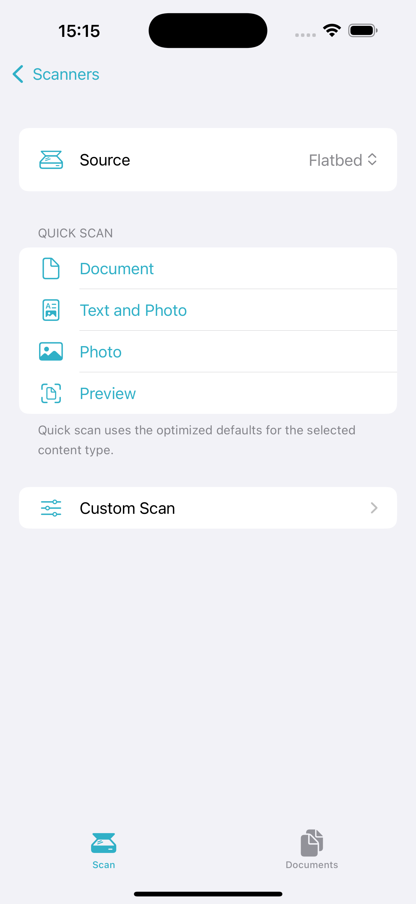
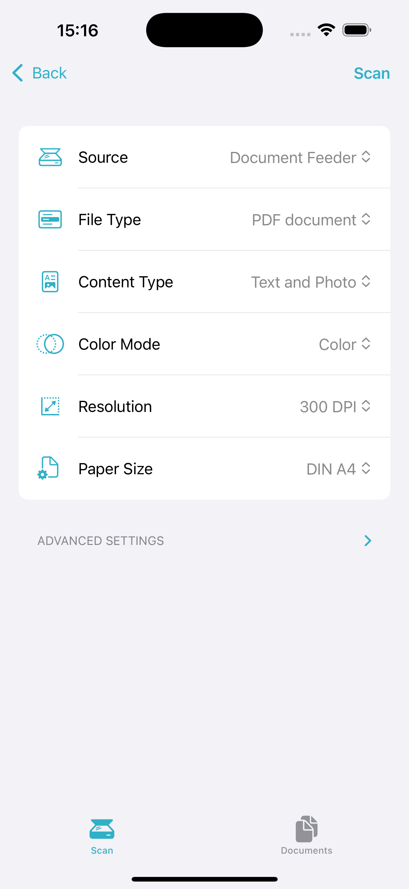
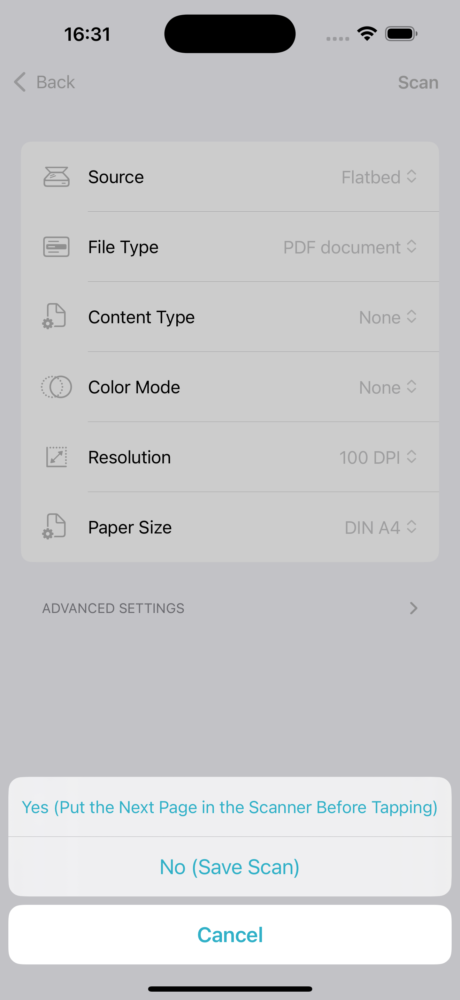

#  OpenAirScan - An example App using my package SwiftESCL

OpenAirScan is now available on the App Store:

This repo contains an entire XCode project with a small example application using the protocol. 
If you're only interested in the actual API, I've created an XCode package (also MIT), that you can check out [here](https://github.com/LeoKlaus/SwiftESCL).

## Using the example application

Either download the App from the App Store or clone and compile the project to any modern iOS device.
After opening the App, it will automatically start searching for devices supporting eSCL via Bonjour (it does need the local network permission for that) and display a list of results:

Tapping a device will lead you to an overview of quick scan actions. You can just select the source and tap "Document" to scan a document. This will have the scanner use defaults for all other settings.

If you want more granular control, you can tap "Custom scan". This will take you to the settings page where you can choose additional parameters like Resolution, Paper Size and File Format:

Pressing "Start scan!" will... start the scan. When the scanner is finished, you will be asked whether you want to scan more pages. This lets you scan documents with multiple pages even if your scanner doesn't support that natively. If you tap "Yes", the scanner will start scanning the next page right away. Pressing "No" will save all pages in a single PDF. "Cancel" discards all pages scanned. The scanned file is available in the "Documents" tab.

From there, you can use the default share sheet to do whatever you like with the document. You can also swipe left on a document in the list to delete it.
