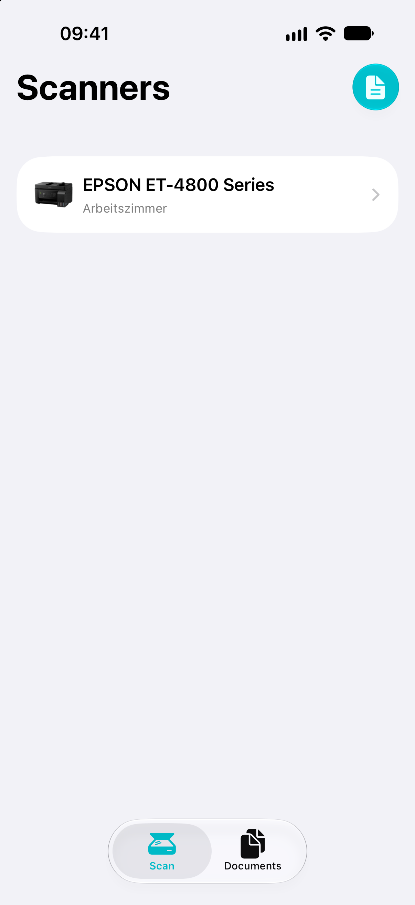
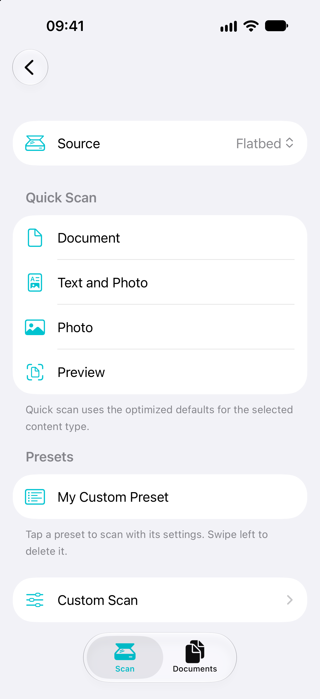
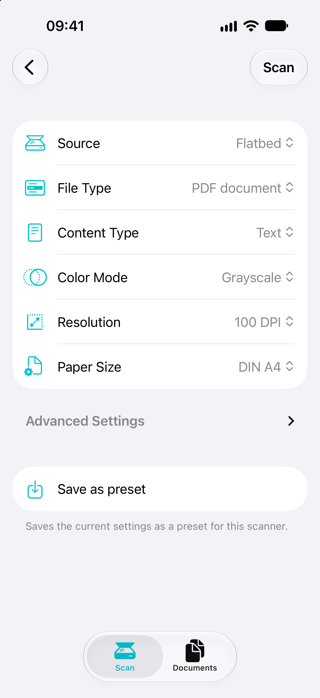
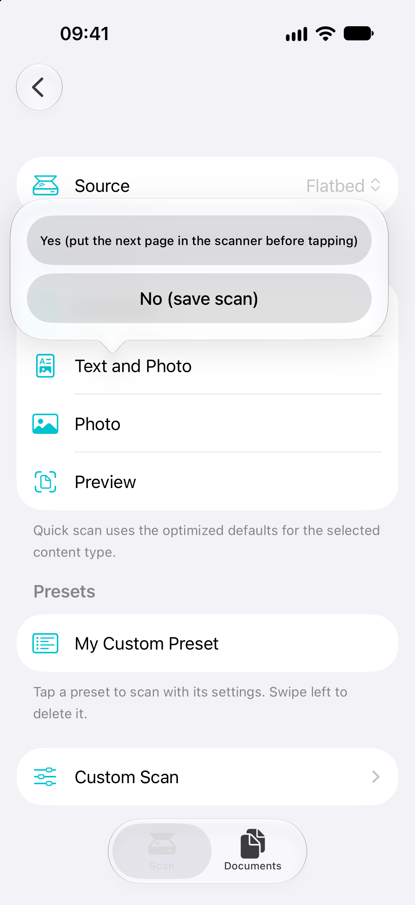

#  OpenAirScan - An example App using my package SwiftESCL

OpenAirScan is now available on the App Store:

This repo contains an entire XCode project with a small example application using the protocol. 
If you're only interested in the actual API, I've created an XCode package (also MIT), that you can check out [here](https://github.com/LeoKlaus/SwiftESCL).

## Using the example application

Either download the App from the App Store or clone and compile the project to any modern iOS device.
After opening the App, it will automatically start searching for devices supporting eSCL via Bonjour (it does need the local network permission for that) and display a list of results:

|  |  |  |  |
| - | - | - | - |