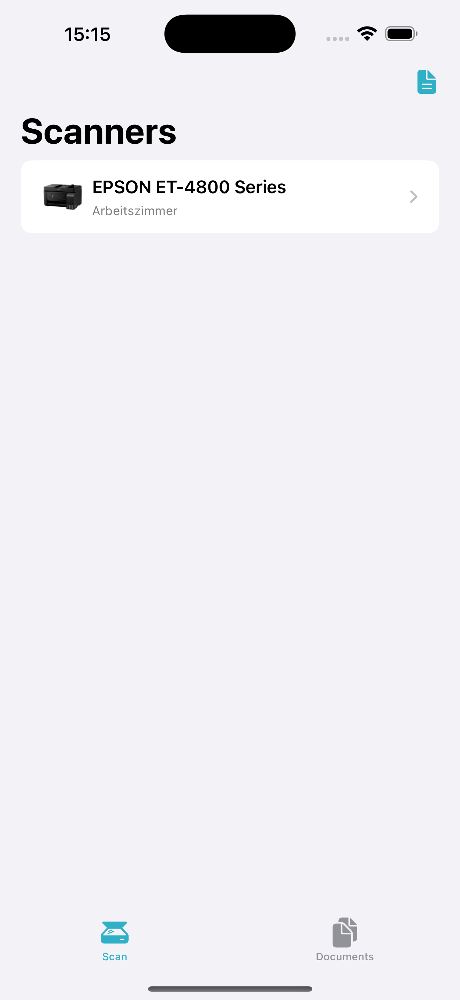

#  OpenAirScan - An example App using my package SwiftESCL

This repo contains an entire XCode project with a small example application using the protocol. 
If you're only interested in the actual API, I've created an XCode package (also MIT), that you can check out [here](https://github.com/LeoKlaus/SwiftESCL).

## Using the example application

I plan to submit this to the AppStore at some point, but currently you need to have a Mac with XCode and a developer account (free is sufficient) to use the example app.

You should be able to just clone and compile the project to any modern iOS device (with some minor changes, the app should also work on Macs).
After opening the App, it will automatically start searching for devices supporting eSCL via Bonjour (it does need the local network permission for that) and display a list of results:

Tapping a device will lead you to the settings page where you can choose parameters like Source, Resolution and File Format:

Pressing "Start scan!" will... start the scan. When the scanner is finished, a success message is displayed and the scanned image is available in the "Documents" tab:

From there, you can use the default share sheet to do whatever you like with the document. You can also swipe left on a document in the list to delete it.
